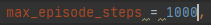

# Trained Warfleet
This project is part of our participation in the *intelligent systems* course at the [HSD]( https://hs-duesseldorf.de/) in Düsseldorf, Germany.   
Our goal is the implementation and training of an [agent](https://en.wikipedia.org/wiki/Intelligent_agent), capable of competently playing the board game *warfleet*, in *python* using [reinforcement learning](https://en.wikipedia.org/wiki/Reinforcement_learning).     
To achieve this we also had to develop a feasible environment for the agent to be trained in.   
For this purpose we chose the [OpenAI Gym](https://gym.openai.com/) toolkit, which provides an easy-to-use suite of reinforcement learning
tasks.

## Current State:
As of today, the 14th of June 2020, the *environment* should be ready to be used to train *agents*.
The rules of the game and the process of playing have been implemented. 
Currently a basic *agent*, which takes random actions, is set up to play against a simple *AI*, which in turn also takes random actions. 
The agent gains a *small reward* for every hit and a *greater reward* for winning a match.

 
 

  The playing field or board of our game is a *10x10* 2D array of the type integer. Possible value here are *1* for water, *2* for parts of a ship and *0* for shot positions.

The action space in our environment consists of all possible coordinates in said board.

The observation space describes the amount of possible values, 3 in this case, for every board position.

 
 
 
 
 
 
 

## Usage Instructions:
Since This project is based on *OpenAi Gym* it requires a python environment with the toolkit installed to function correctly.
You could either set this up beforhand or simple add *gym* to your environment after cloning or downloading this repository.
All you have to do after that to test our project is *run* the *main.py* file.

 

 To view mid game board states easier you could also adjust the maximum step size in *init.py* in the *gym_wf* folder.

 ...

 
 
 
 
 
 
 
 
 
 

 ...

 
 
 
 
 
 
 
 
 
 
 
 
 
 
 
 
 
 
 
 
 
 
 

 ...

 
 
 
 
 
 
 
 
 

## Future Outlook:
Next up is the incorporation of reinforcement learning algorithems using the [OpenAI Baselines](https://github.com/openai/baselines) framework leading into the training of multiple agents with a selection of the aforementioned algorithems.

