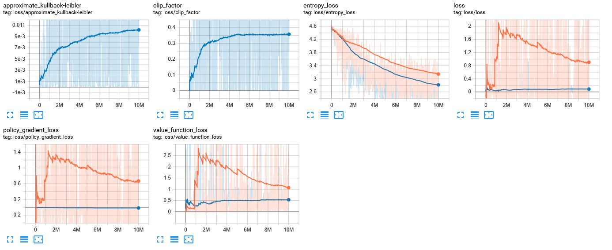

# Trained Warfleet (Group-ID 6)
This project is part of our participation in the *intelligent systems* course at the [HSD]( https://hs-duesseldorf.de/) in Düsseldorf, Germany.   
Our goal is the implementation and training of an [agent](https://en.wikipedia.org/wiki/Intelligent_agent), capable of competently playing the board game *warfleet*, in *python* using [reinforcement learning](https://en.wikipedia.org/wiki/Reinforcement_learning).     
To achieve this we also had to develop a feasible environment for the agent to be trained in.   
For this purpose we chose the [OpenAI Gym](https://gym.openai.com/) toolkit, which provides an easy-to-use suite of reinforcement learning
tasks.

## Current State:
The *environment* is ready to be used to train *agents*. 
The rules of the game and the process of playing have been implemented. 
Currently a basic *agent*, which takes random actions, is set up to play against a simple *AI*, which in turn also takes random actions. 
The agent gains a *small reward* for every hit and a *greater reward* for winning a match. 
 
The [OpenAI Baselines](https://github.com/openai/baselines) framework enabled us the train models using the PPO2 and A2C algorithems.

 
 

  The playing field or board of our game is a *10x10* 2D array of the type *integer*. Possible values here are *1* for water, *2* for parts of a ship and *0* for shot positions.

The action space in our environment consists of all possible coordinates in said board.

The observation space describes the amount of possible values, 3 in this case, for every board position.

 
 
 
 
 
 
 
 
 

## Usage Instructions:
Since this project is based on *OpenAi Gym* it requires a python environment with the toolkit installed to function correctly.
You can either set this up beforehand or simply add *gym* to your environment after cloning or downloading this repository.
All you have to do is to run one of these files: 
 
To train the agents you can run the **trainAgents.py** 
To test the agents you can run the **testAgents.py** 
 

 

The console prompt will ask for the algorithm and the timessteps.  

 
 

 Here you can see the *console output* of the agent's board after all ships have been placed and the firing of multiple shots from both sides/players. Once again:  
*0 = shot*  
*1 = water*  
*2 = ship*  

 
 
 
 
 
 
 To the left we have a representation of the agent's opponent's board and below that the respective representation of the agent's board in a certain game state. As you can see the agent won by destorying all of its opponent's ships while 2 of its ships still remain partially intact. 

 
 
 
 
 
 
 
 
 
 
 
 
 
 
 
 
 
 
 
 
 

 This image shows the *last state* which resulted in the agent winning this match. In this case it took *295 episode steps* to finish the match and the agent gained a *combined reward of 42*.

 
 
 
 
 
 
 
 
 
 
<h2>End of the game</h2>
At the end of the game you can see that the agent has won the game and shot every ship.
The Enemy shot the agent ships by random choice. So the shots have no structure or strategy.
The Agent shot every ship by its length. If a ship is hit, the next ship possition is just one field beside.

 
 
 
 
 
 
 
 
 
 
 
 
 
 
 
 
 
 
 
 
 
 
 

## Tensorboard diagrams:

<h3>Discount Reward</h3>

 
 

 
 

 
 

 
 

## Future Outlook:
...

